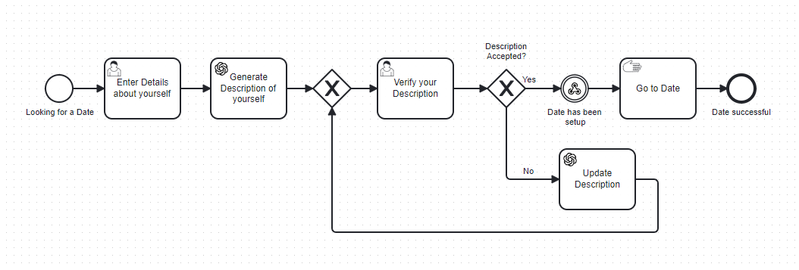

# Dating Profile Creator Example

This is a process that helps you generate a good dating profile. It uses BPMN and Camunda 8 as a framework and serves as an example of integrations of ChatGPT and webhooks.

## Setup

You will need to create an OpenAI account and get an API key so that you can make calls to ChatGPT. You’ll also need a Camunda 8 Cluster (the easiest place to do that is [Camunda SaaS](https://signup.camunda.com/accounts)). Then the fun can start!

## Adding Credentials

🔐 It’s important to know that it’s best practice not to simply copy and paste this sensitive information directly into the model but rather to [create a secret](https://docs.camunda.io/docs/components/console/manage-clusters/manage-secrets/) for each of these in your Camunda cluster. Then you can reference it by typing `{{secrets.yourSecretHere}}` followed by the name of the key you want to access.

For this example to work you'll need to create a secret to use the OpenAi connector. It needs to be called:

- OpenAI

## Deploy and Start

Once you have both accounts, it's pretty easy to get started. Upload the BPMN model and the Forms from their respective folders and add them to your Camunda 8 account. From the modeler you can deploy the process to a cluster.

You can start the process from the Modeler or from Tasklist.
